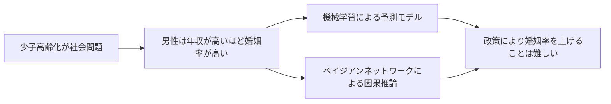

```mermaid
graph LR
    A[少子高齢化が社会問題]
    B[男性は年収が高いほど婚姻率が高い]
    C[ベイジアンネットワークによる因果推論]
    CC[機械学習による予測モデル]
    D[政策により婚姻率を上げることは難しい]

    A --> B
    B --> C
    B --> CC
    CC --> D
    C --> D

```

